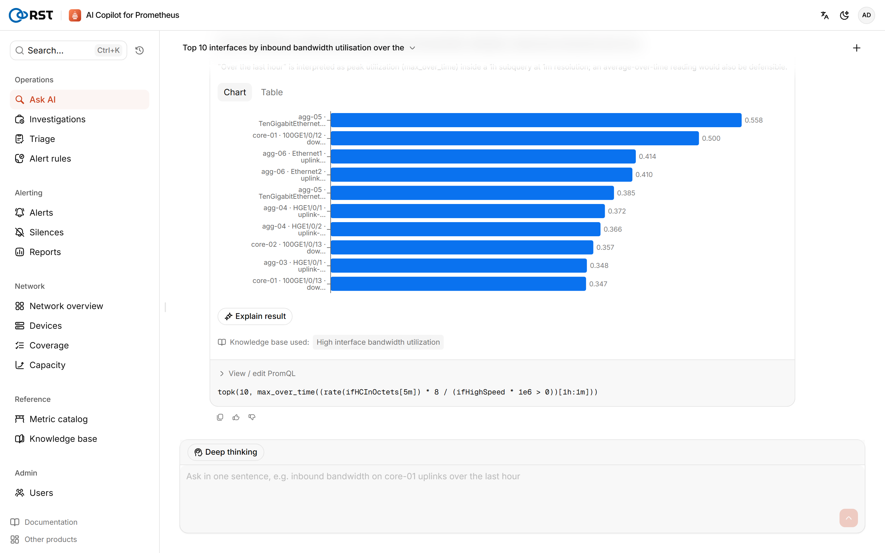
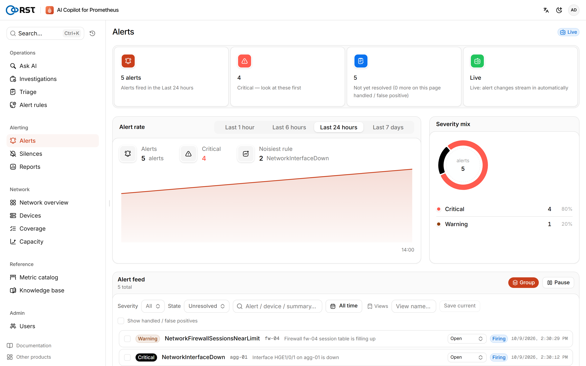
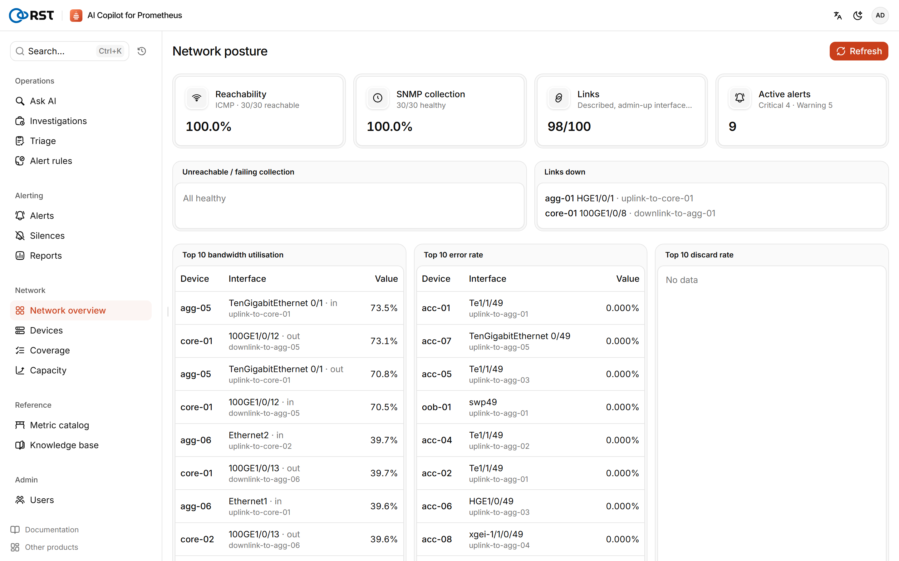
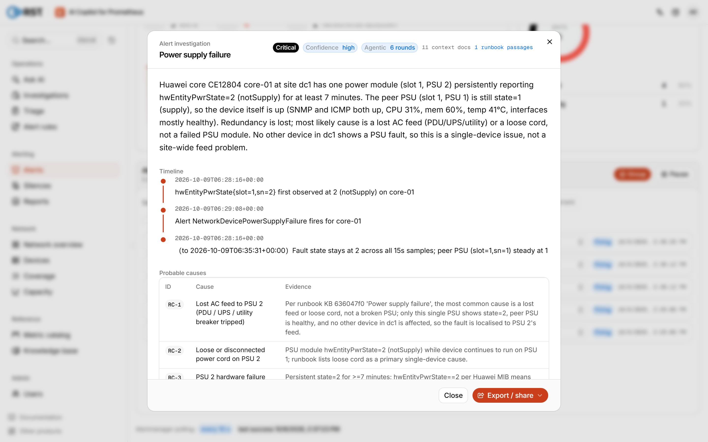
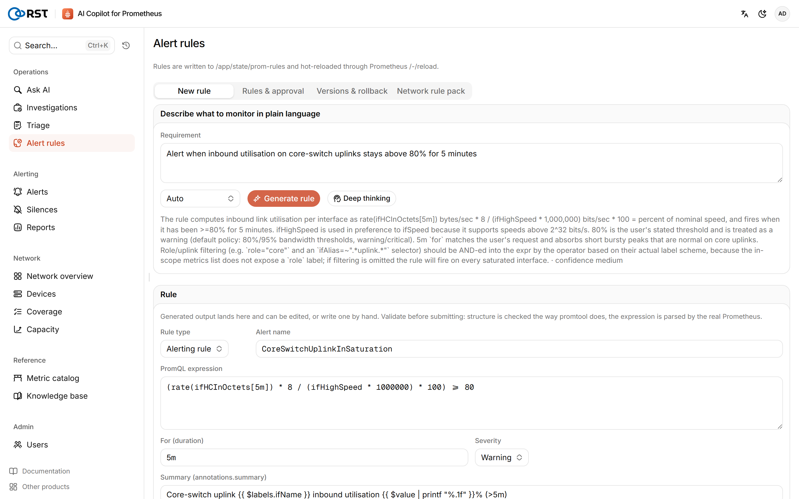
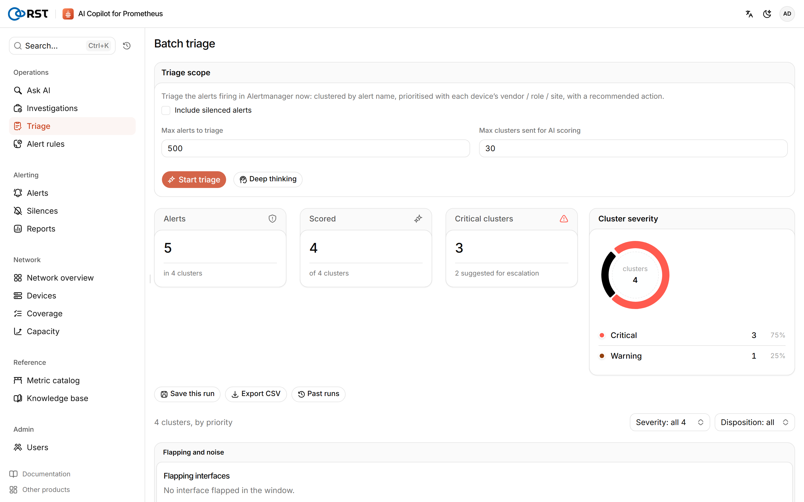
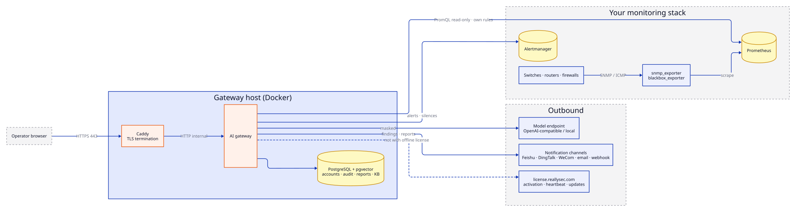

<p align="center">
  
</p>

<h1 align="center">RST AI Copilot for Prometheus</h1>

<p align="center">
  <b>Run your network monitoring in plain language.</b><br>
  A self-hosted AI copilot for network operations that sits next to your existing Prometheus®, Alertmanager and Grafana:<br>
  metric queries, alert triage and root-cause investigation, alert-rule generation, and daily / weekly reports<br>
  for switches, routers and firewalls. Read-only queries, offline deployment, every model call audited.
</p>

<p align="center">
  <b>English</b> · <a href="README.zh-CN.md">简体中文</a> · <a href="https://reallysec.com/en/docs/prometheus-ai-copilot">Docs</a> · <a href="https://github.com/Reallysec/RST-AI-Copilot-for-Prometheus/releases">Download</a> · <a href="docs/RELEASE-NOTES.md">Release notes</a>
</p>

<p align="center">
  
</p>

## Why RST AI Copilot for Prometheus

- **Uses the monitoring you already run.** One Docker gateway next to your Prometheus, Alertmanager and Grafana.
  snmp_exporter and blackbox_exporter keep collecting device metrics as before; the Copilot installs no agents
  and keeps no second copy of your time series.
- **Knows network devices.** Ships a metric dictionary and an alert-rule pack for IF-MIB, HOST-RESOURCES-MIB,
  ENTITY-SENSOR-MIB and the private MIBs of Huawei, H3C, Cisco, Ruijie, Juniper, Fortinet, Sangfor and more.
  Vendors are recognised by `sysObjectID`; anything unrecognised falls back to the standard MIBs.
- **Read-only queries, controlled writes.** Every generated PromQL expression is validated against your real
  Prometheus before it runs. The Copilot only writes its own rule files and Alertmanager silences; rule
  deployment needs an approval and can be rolled back.
- **Data stays in your network.** IP addresses, host names and user names in metric labels are masked before
  anything reaches the model. Use Volcengine Ark, any OpenAI-compatible endpoint, or a local vLLM / Ollama to
  run fully offline.
- **Every step is traceable.** Every login, query, model call and settings change is an audit event in PostgreSQL.

## Quick start

You need a Linux host (Docker Engine 24+, Compose v2) that can reach your Prometheus and Alertmanager
(Grafana is optional) and a host name or IP for the operators. An OpenAI-compatible model endpoint is
recommended; without one, queries fall back to keyword generation and are marked low-confidence
([full requirements](https://reallysec.com/en/docs/prometheus-ai-copilot/install/requirements)).

With the delivery bundle:

```bash
sha256sum -c RST-AI-Copilot-for-Prometheus-<version>.tar.gz.sha256
tar xzf RST-AI-Copilot-for-Prometheus-<version>.tar.gz
cd RST-AI-Copilot-for-Prometheus-<version> && ./deploy.sh
```

`deploy.sh` loads the images, generates secrets and the host fingerprint, asks for the model endpoint and the
Prometheus / Alertmanager / Grafana addresses and credentials, lets you set the admin password, and starts the
gateway and the bundled PostgreSQL (pgvector) behind Caddy TLS. After about two minutes open
`https://<host or IP>/v2/` and sign in as `admin`. You can leave the data sources blank and fill them in later
under Settings → Data sources, which tests the connection before saving.

Upgrade, rollback, backup, SSO and every `.env` key: [installation docs](https://reallysec.com/en/docs/prometheus-ai-copilot/install/deploy).

No network devices yet? Layer the network lab on the deployment stack: 30 simulated devices from 13 vendors
plus a bundled Prometheus, Alertmanager and Grafana:

```bash
docker compose -f docker-compose.prod.yml -f docker-compose.lab-demo.yml up -d --build
```

See section 9 of the [deployment guide](docs/DEPLOYMENT.en.md).

## Features

- **Natural-language queries**: questions become PromQL, validated on Prometheus before running and repaired
  automatically when validation fails; multi-turn follow-ups; results as time-series charts and tables.
- **Metric dictionary and knowledge base**: descriptions for standard and vendor MIB metrics; a runbook
  knowledge base (pgvector retrieval) that investigations cite.
- **Live alerts and silences**: alerts read from Alertmanager with Grafana links; create and expire silences,
  all audited.
- **Alert triage and root-cause investigation**: batch triage grouped by device and interface; an agentic
  investigation that gathers evidence from live metrics step by step and ends with a conclusion and actions.
- **Alert rules**: write a rule by hand or have the AI draft it, then approve → write the Copilot's own rule file →
  Prometheus hot reload → roll back.
- **Network operations**: device inventory (with interface `ifAlias`), network posture, monitoring-coverage
  baseline, capacity forecasting, Prometheus / Alertmanager self-check.
- **Reports**: daily and weekly network operations reports covering alerts, top-utilised links, errors and
  discards, device availability, capacity risk and AI investigation summaries; history, schedules, export.
- **Notifications**: Feishu, DingTalk, WeCom, email and webhook. **Only AI output is delivered**
  (investigation conclusions, daily / weekly reports). Alert routing is not replaced: grouping, inhibition
  and paging stay with your Alertmanager, so nobody gets the same alert twice.
- **Privacy and audit**: three label-masking levels (cloud / private / local model), audit events, optional
  audit forwarding.
- **Sign-in and roles**: local accounts with three roles (`admin` / `operator` / `viewer`), optional OIDC single
  sign-on (Keycloak, which can federate LDAP / AD).

<table>
  <tr>
    <td width="50%"></td>
    <td width="50%"></td>
  </tr>
</table>

## Editions

One bundle for every edition: without a license it runs as the free Community edition (one user); activating a
license on the License page (`/v2/license`) unlocks Professional or Enterprise in place, without reinstalling: data
and host fingerprint are kept.

- **Community** (free): natural-language queries, live alerts and silences, label masking, metric dictionary,
  knowledge base, device inventory, monitoring coverage, network posture, hand-written alert rules with approval,
  write-back and rollback, local audit log, notification setup, online updates.
- **Professional** (per user): batch alert triage, agentic alert investigation with incident reports, AI alert-rule
  generation, Prometheus / Alertmanager self-check, capacity forecasting, alert noise reduction and reports.
- **Enterprise**: OIDC single sign-on, audit forwarding, multi-provider model failover, offline license activation
  and more nodes.

A 14-day trial covers every Enterprise feature on one host. Paid features stay visible in Community: clicking one
opens an upgrade dialog. See the [editions page](https://reallysec.com/en/docs/prometheus-ai-copilot/editions).

<table>
  <tr>
    <td width="50%"></td>
    <td width="50%"></td>
  </tr>
</table>

<p align="center">
  
</p>

## Architecture and data boundary

<p align="center">
  
</p>

- Inbound: only 443 from the operators' browsers. Outbound: the model endpoint, your Prometheus / Alertmanager,
  the notification channels you configure, and `license.reallysec.com` (not needed with an offline license).
  Grafana is only used to build links for the browser; the gateway never calls its API.
- Labels are masked according to the masking level before they reach the model; the local-model level sends
  nothing out.

## Supported versions

| Component | Support |
|---|---|
| Prometheus | 2.43 or later (lab-verified on 2.53) |
| Alertmanager | 0.25 or later (lab-verified on 0.27 / 0.28) |
| Grafana | 9 or later, optional (links only) |
| Collection | snmp_exporter, blackbox_exporter |
| Model endpoint | Volcengine Ark, any OpenAI-compatible API, local vLLM / Ollama |
| Host | Linux, Docker Engine 24+ and Docker Compose v2 |

## Documentation

- [Product documentation](https://reallysec.com/en/docs/prometheus-ai-copilot) on reallysec.com: quick start, installation, user guide, FAQ
- [Deployment guide](docs/DEPLOYMENT.en.md) ([中文](docs/DEPLOYMENT.md)), also shipped in every bundle
- [Backup and restore](docs/BACKUP.md)
- [Release notes](docs/RELEASE-NOTES.md)
- [Third-party notices](THIRD-PARTY-NOTICES.md)

## License

RST AI Copilot for Prometheus is proprietary software delivered as compiled container images under the End User
License Agreement (`docs/EULA.md`). "RST", "Reallysec" and the product mark are trademarks of Reallysec.

## Trademarks

Prometheus® is a registered trademark of The Linux Foundation in the United States and/or other countries.
RST AI Copilot for Prometheus is an independent product of Reallysec. It works with Prometheus but is not
affiliated with, endorsed by, or sponsored by The Linux Foundation or the Prometheus project. Grafana and other
names may be trademarks of their respective owners.

© Anhui Reallysec Information Technology Ltd.
