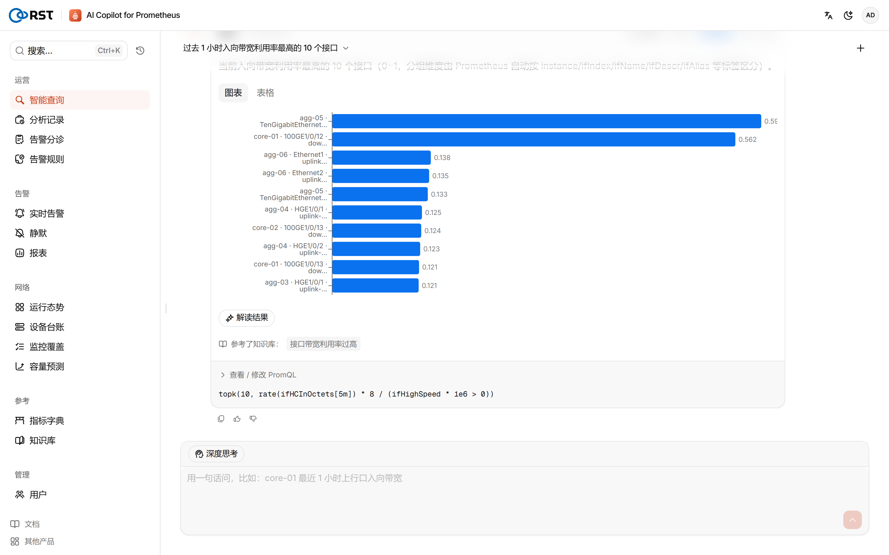
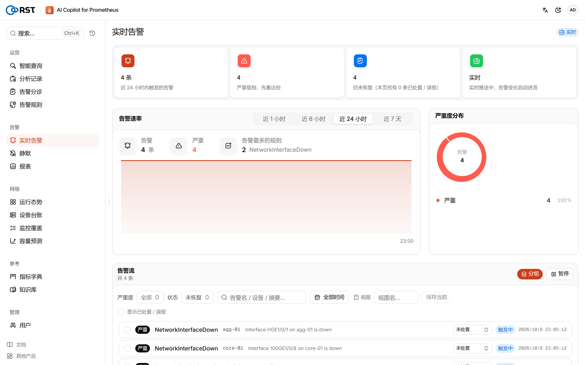
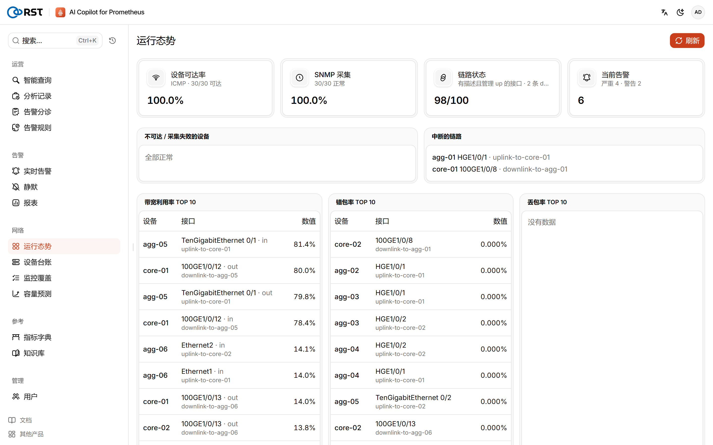
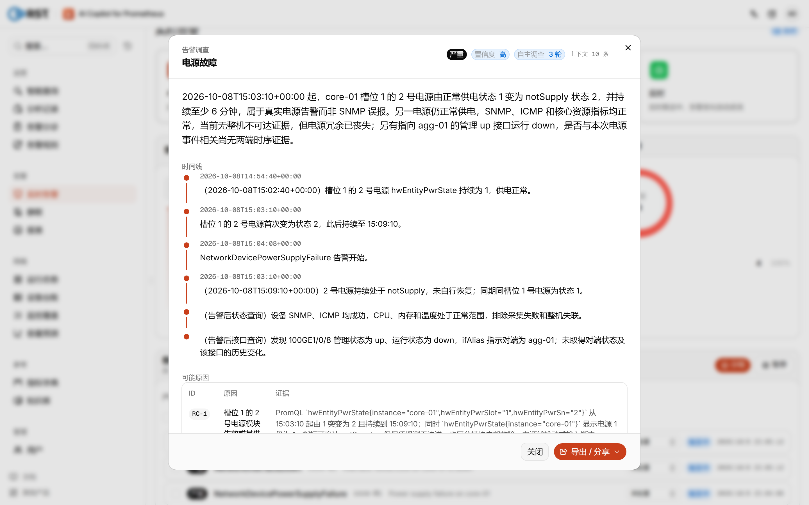
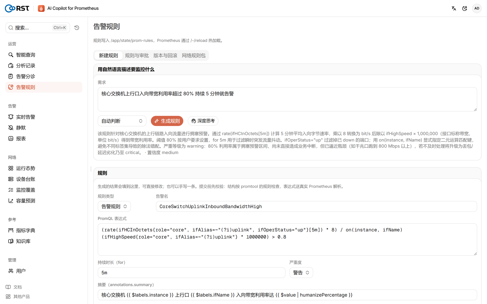
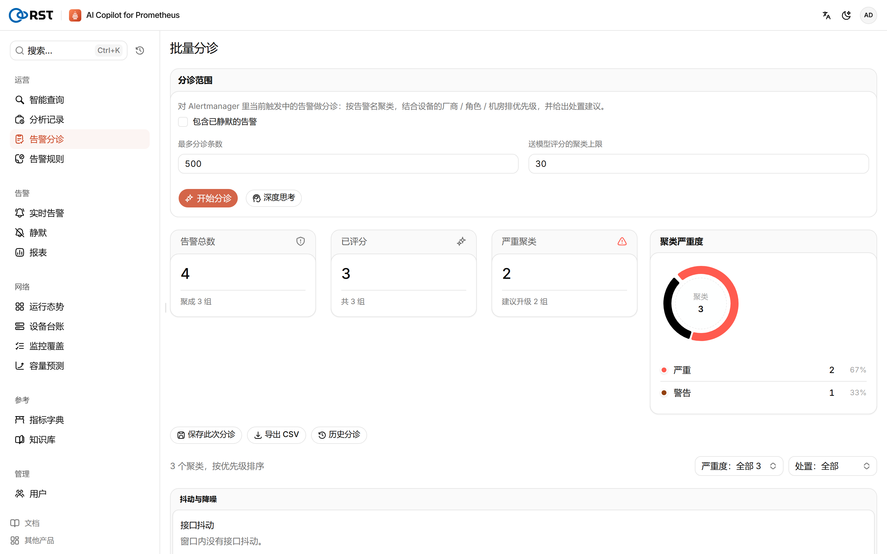
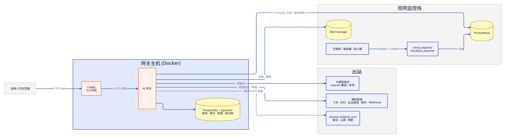

<p align="center">
  
</p>

<h1 align="center">RST AI Copilot for Prometheus</h1>

<p align="center">
  <b>用自然语言管你的网络监控。</b><br>
  接在已有 Prometheus® / Alertmanager / Grafana 上的私有化网络运维 AI 副驾：<br>
  交换机、路由器、防火墙的指标查询、告警分诊与根因调查、告警规则生成、日报周报。<br>
  只读查询、可离线部署，每一次模型调用都有审计。
</p>

<p align="center">
  <a href="README.md">English</a> · <b>简体中文</b> · <a href="https://reallysec.com/docs/prometheus-ai-copilot">文档</a> · <a href="https://github.com/Reallysec/RST-AI-Copilot-for-Prometheus/releases">下载</a> · <a href="docs/RELEASE-NOTES.md">发版说明</a>
</p>

<p align="center">
  
</p>

## 为什么选 RST AI Copilot for Prometheus

- **直接用你现有的监控。** 一个 Docker 网关，接在已有的 Prometheus、Alertmanager 和 Grafana 旁边。设备指标由
  snmp_exporter、blackbox_exporter 照常采集，Copilot 不装采集端、不另存一份时序数据。
- **懂网络设备。** 预置 IF-MIB、HOST-RESOURCES-MIB、ENTITY-SENSOR-MIB 和华为、H3C、Cisco、锐捷、Juniper、
  Fortinet、深信服等厂商私有 MIB 的指标字典与告警规则包；厂商按 `sysObjectID` 识别，识别不出的走通用 MIB。
- **只读查询，可控写入。** 生成的 PromQL 执行前先在真实 Prometheus 上校验。Copilot 只写自己的规则文件和
  Alertmanager 静默，规则部署要审批，可回滚。
- **数据留在你的网络里。** 发给大模型之前，指标标签里的 IP、主机名、用户名先脱敏。大模型可以接火山方舟、
  任意 OpenAI 兼容端点，或自建 vLLM / Ollama 完全离线运行。
- **每一步都可追溯。** 每次登录、查询、模型调用、设置变更都是一条审计事件，存在 PostgreSQL 里。

## 快速开始

需要一台 Linux 主机（Docker Engine 24+、Compose v2），能访问你的 Prometheus 和 Alertmanager（Grafana 可选），
以及一个给运维人员用的域名或 IP。建议配一个 OpenAI 兼容的大模型端点；不配也能用，查询退回关键词生成并标为低可信度（[完整要求](https://reallysec.com/docs/prometheus-ai-copilot/install/requirements)）。

拿到交付包后：

```bash
sha256sum -c RST-AI-Copilot-for-Prometheus-<版本>.tar.gz.sha256
tar xzf RST-AI-Copilot-for-Prometheus-<版本>.tar.gz
cd RST-AI-Copilot-for-Prometheus-<版本> && ./deploy.sh
```

`deploy.sh` 加载镜像、生成密钥和主机指纹，询问大模型、Prometheus / Alertmanager / Grafana 地址与认证，让你设定
管理员口令，然后在 Caddy TLS 后面起网关和自带的 PostgreSQL（pgvector）。约两分钟后打开 `https://<域名或 IP>/v2/`，
用 `admin` 登录。数据源地址也可以留空，装完在「设置 → 数据源连接」里填，保存前会先测连通。

升级、回滚、备份、单点登录和 `.env` 的全部配置项见[安装文档](https://reallysec.com/docs/prometheus-ai-copilot/install/deploy)。

没有网络设备也想先看效果？用网络实验室叠加部署栈，起 30 台模拟设备（13 个厂商）和自带的 Prometheus、
Alertmanager、Grafana：

```bash
docker compose -f docker-compose.prod.yml -f docker-compose.lab-demo.yml up -d --build
```

详见[部署手册](docs/DEPLOYMENT.md)第 9 节。

## 功能

- **智能查询**：自然语言生成 PromQL，执行前在 Prometheus 上校验，校验失败自动修正；多轮追问，结果出时序图和表格。
- **指标字典与知识库**：标准 MIB 和厂商私有 MIB 的指标说明；运行手册知识库（pgvector 检索）供调查引用。
- **实时告警与静默**：读取 Alertmanager 的告警，跳转 Grafana；创建、撤销静默，全部写审计。
- **告警分诊与根因调查**：批量分诊，按设备、接口聚合；agentic 调查用实时指标逐步取证，给出结论和处置建议。
- **告警规则**：手写或由 AI 生成规则，审批 → 写回 Copilot 自己的规则文件 → Prometheus 热加载 → 可回滚。
- **网络运维专项**：设备台账（含接口 `ifAlias`）、网络运行态势、监控覆盖基线、容量预测、Prometheus / Alertmanager 自检。
- **报表**：网络运维日报、周报：告警概况、利用率 TOP 链路、错包 / 丢包、设备可用率、容量风险、AI 调查结论摘要；
  历史归档、定时生成、导出。
- **通知**：飞书、钉钉、企业微信、邮件、Webhook。**只投递 AI 产出**（调查结论、日报周报），不做告警路由；
  告警的分组、抑制和通知仍由你的 Alertmanager 负责，避免重复告警。
- **隐私与审计**：标签脱敏三档（云端 / 私有 / 本地模型）、审计事件、可选审计外发。
- **登录与权限**：本地账户（`admin` 管理员 / `operator` 运维工程师 / `viewer` 只读，三档角色），可选 OIDC 单点登录（Keycloak，可接 LDAP / AD）。

<table>
  <tr>
    <td width="50%"></td>
    <td width="50%"></td>
  </tr>
</table>

## 版本

同一个交付包：不导入许可为免费的社区版（1 个用户），在「产品激活」页（`/v2/license`）激活许可后原地解锁专业版或企业版，
不用重装，数据和主机指纹保留。

- **社区版**（免费）：智能查询、实时告警与静默、标签脱敏、指标字典、知识库、设备台账、监控覆盖、网络运行态势、
  手写告警规则及审批 / 写回 / 回滚、本地审计、通知配置、在线更新。
- **专业版**（按用户数）：批量告警分诊、agentic 告警调查与故障报告、AI 生成告警规则、Prometheus / Alertmanager 自检、
  容量预测、告警降噪和运营报表。
- **企业版**：OIDC 单点登录、审计外发、多模型故障转移、离线许可激活和更多节点。

试用为 14 天企业版全功能、单节点。付费功能在社区版里照样可见，点击时提示升级。详见[版本说明](https://reallysec.com/docs/prometheus-ai-copilot/editions)。

<table>
  <tr>
    <td width="50%"></td>
    <td width="50%"></td>
  </tr>
</table>

<p align="center">
  
</p>

## 架构与数据边界

<p align="center">
  
</p>

- 入站只有运维人员浏览器的 443。出站：大模型端点、你的 Prometheus / Alertmanager、你配置的通知渠道、
  `license.reallysec.com`（离线许可时不需要）。Grafana 只用于生成浏览器跳转链接，网关不调它的 API。
- 发给模型之前，标签里的 IP、主机名、用户名按脱敏档处理；本地模型档不出网。

## 支持的版本

| 组件 | 支持情况 |
|---|---|
| Prometheus | 2.43 及以上（实验室用 2.53 验证） |
| Alertmanager | 0.25 及以上（实验室用 0.27 / 0.28 验证） |
| Grafana | 9 及以上，可选（用于跳转链接） |
| 采集 | snmp_exporter、blackbox_exporter |
| 大模型端点 | 火山方舟、任意 OpenAI 兼容 API、自建 vLLM / Ollama |
| 主机 | Linux，Docker Engine 24+ 与 Docker Compose v2 |

## 文档

- [产品文档](https://reallysec.com/docs/prometheus-ai-copilot)（reallysec.com）：快速开始、安装、使用指南、常见问题
- [部署手册](docs/DEPLOYMENT.md)（[English](docs/DEPLOYMENT.en.md)），也随每个交付包提供
- [备份与恢复](docs/BACKUP.md)
- [发版说明](docs/RELEASE-NOTES.md)
- [第三方组件声明](THIRD-PARTY-NOTICES.md)

## 许可

RST AI Copilot for Prometheus 是专有软件，以编译后的容器镜像交付，依据《最终用户许可协议》（`docs/EULA.md`）使用。
「RST」「Reallysec」「斯普朗克」和产品标识是版权人的商标。

## 商标

Prometheus® 是 The Linux Foundation 在美国和/或其他国家的注册商标。RST AI Copilot for Prometheus 是斯普朗克的独立产品，
可与 Prometheus 配合使用，但与 The Linux Foundation 或 Prometheus 项目不存在隶属、认可或赞助关系。Grafana 及其他名称
可能是其各自所有者的商标。

© 安徽斯普朗克信息技术有限公司（Anhui Reallysec Information Technology Ltd.）
